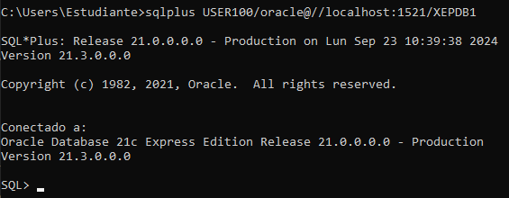

Nombre: Matías Bugueño

RUT: 21.120.023-5

# Taller de BD: Gestión de usuarios en Oracle
### 1.  Creando Usuario

El comando "CREATE USER USER100 IDENTIED BY 123 DEFAULT TABLESPACE USERS QUOTA UNLIMITED ON USERS" lo que hace es crear un usuario llamado USER100 con contraseña 123, además de indicar que toda acción que realice el usuario será en la espacio USERS dado por defecto con posibilidad de usar una cuota ilimitada.

### 2.  LISTA DE USUARIOS
El comando "SELECT * FROM DBA_USERS" enlista a todos los usuarios disponibles en la base de datos.

### 3. ELIMINACIÓN DE USUARIO
El comando "DROP USER USER200" intentará de eliminar al usuario 200 de la base de datos, indicandonos si tuvo éxito o no.

### 4. CAMBIO DE PASSWORD
De estos dos comandos "ALTER USER USER100 IDENTIFIED BY oracle; GRANT DBA TO USER100;", el primero cambia la constraseña del usuario USER100 a oracle y el segundo comando le da el rol de administrador de la base de datos al usuario USER100.

Ahora con el rol de administrador, esto ocurre al momento de conectarse.

Ya con el rol de administrador tenemos acceso de conexión.

### 5. BLOQUEO DE CUENTAS

El comando "ALTER USER USER100 ACCOUNT LOCK;" lo que provoca es bloquear el usuario USER100 al acceso a la base de datos.

Ahora si intentamos conectarnos ocurre lo siguiente.

La cuenta se encuentra bloqueada, pero si utilizamos el comando "ALTER USER USER100 ACCOUNT UNLOCK;" desbloquearemos al usuario permitiendole nuevamente poder hacer acceso a la base de datos.

### 6. EXPIRACIÓN DE PASSWORD

El comando "ALTER USER USER100 PASSWORD EXPIRE;" provoca que la contraseña que poseía el usuario USER100 expire y este al volver a hacer ingreso a la base de datos deba cambiar su contraseña.

Al intentar hace conexión:

