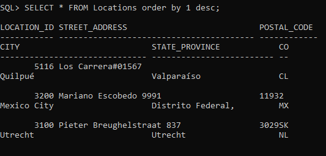

# Taller Formativo de transacciones

Matías Bugueño / 21.120.023-5

## 1. Crear la tabla de Práctica

## 2. Inserción sin Commit 

## 3. Verificar el estado de la transacción

## 4. Abrir otra sesión

En el segundo registro no se logra visualizar la transacción ya que la primera transacción no ha sido confirmada, por lo tanto esta última no ha sido subida al esquema general.

## 5. Aplicar "COMMIT"

## 6. Utilización de "ROLLBACK"

## 7. Simulación de un Error

## 8. Conclusión

Las transacciones son cruciales para la integridad de los datos en las bases de datos, ya que dependiendo de como las utilicemos esto puede llegar a generar errores en nuestro sistemas, por esta misma razón el uso de los comandos COMMIT y ROLLBACK son sumamente importantes, ya que con el COMMIT podemos evitar subir errores enormes a la base dedatos y podemos verificar que todo está en orden antes de enviar las cosas a producción, también el ROLLBACK que nos ayuda a volver a diversos puntos de guardados en el caso de haber un error que se deba solucionar.

***

# Taller SQL - Manejo de Transacciones

## Primera Parte: Control de Transacciones

### 1. Inserte en la tabla "countries" a Chile (country_name) con código de país (country_id) CL y región (region_id) 2. Realice un commit para registrar en la base de datos el cambio.

### 2. Haga una consulta para mostrar el contenido de la tabla

### 4. Escriba y ejecute las siguientes sentencias de la transacción:

### 5. Escriba rollback to inserta5118; y vuelva a mostrar el contenido de la tabla. Cuál es la diferencia?

Al realizar el ROLLBACK y volviendo a realizar la consulta a la tabla Locations nos podemos dar cuenta que se restablecio el punto de guardado cuando se intertaron los datos con location_id = 5118.

### 6. Escriba rollback to inserta5116; y vuelva a mostrar el contenido de la tabla. Explique la diferencia de resultados de los puntos 5 y 6.

Al realizar el ROLLBACK en el punto de guardado inserta5116, volvemos al punto de guardado que teníamos antes de todos los cambios siguientes a la inserción de la fila con location_id = 5116.

### 7. Realice un rollback; 8. Ahora vuelva a repetir el punto 4.

### 9. Escriba rollback to inserta5116; y vuelva a mostrar el contenido de la tabla.

### 10. Escriba rollback to inserta5118; ¿Por qué se generó este problema?

Este error nos quiere decir que el SAVEPOINT inserta5118 no existe para la sesión en la que nos encontramos, esto ocurre ya que nos posicionamos en un punto previo a la creación del SAVEPOINT inserta5118.

### 11. Ejecuta commit. Muestre el resultado final de la tabla.

### 12. Abra una nueva conexión con el usuario RH. Muestre los datos de la tabla.

### 13. En esta segunda conexión ejecute lo siguiente:

### 14. Vuelva a la primera sesión (primera conexión con HR) y escriba la consulta para visualizar la tabla. ¿Son iguales los resultados? Explique el motivo de los resultados obtenidos.

Los resultados no son iguales ya que la segunda sesión aún no confirma los nuevos datos insertados con el comando COMMIT, provocando que la primera sesión aún no pueda visualizar los cambios realizados.

### 15. En la segunda sesión, realice un commit y escriba la consulta para visualizar la tabla. Note que en las últimas filas ingresadas no se ingresaron valores para la columna provincia. Realice una sentencia SQL que actualice el registro de la localidad 5118 indicando que su Provincia es Valparaíso. Escriba la consulta para visualizar la tabla actualizada.

### 16. En la primera sesión actualice el registro de la localidad 5119 indicando que su Provincia es Valparaíso. Escriba la consulta para visualizar la tabla actualizada.

### 17. En la primera sesión, realice una sentencia SQL que actualice el registro de la localidad 5118 indicando que su código postal es "240030". Explique la respuesta dada por el gestor de base de datos.

Lo que podemos ver al intentar llevar a cabo esta actualización en la base de datos es un bloque de oracle, ya que dos sesiones distintas intentaron de llevar a cabo una modificación en la misma tabla y en la misma fila, llevando a cabo un problema de concurrencia de transacciones.

### 18. Escriba las sentencias pertinentes para que los últimos cambios queden almacenados y visibles para todos.

Lo primero que debemos hacer es llevar a cabo el commit de nuestros cambios en la segunda sesión, ya que esta es la que está generando el bloqueo.

Una vez subidos los cambios de la segunda sesión, en la primera sesión se finaliza el bloqueo.

***